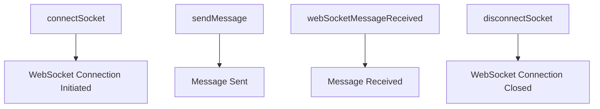

Actions refer to the operations that can be dispatched to the Redux store to update the state.

They are defined as plain JavaScript objects that have a <SwmToken path="src/actions/index.js" pos="4:1:1" line-data="    type: CONNECT_SOCKET,">`type`</SwmToken> property and can include additional data.

In this project, actions are used to manage WebSocket connections and communication.

For example, the <SwmToken path="src/actions/index.js" pos="11:4:4" line-data="export const connectSocket = (host, port, secure, contextPath) =&gt; (dispatch) =&gt; {">`connectSocket`</SwmToken> action is used to initiate a WebSocket connection with a specified host and port.

The <SwmToken path="src/actions/index.js" pos="25:4:4" line-data="export const sendMessage = (message, host, port, secure) =&gt; (dispatch) =&gt; {">`sendMessage`</SwmToken> action is used to send a message through the WebSocket connection.

The <SwmToken path="src/actions/index.js" pos="31:4:4" line-data="export const webSocketMessageReceived = (message) =&gt; ({">`webSocketMessageReceived`</SwmToken> action is used to handle incoming messages from the WebSocket.

The <SwmToken path="src/actions/index.js" pos="42:4:4" line-data="export const disconnectSocket = () =&gt; (dispatch) =&gt; {">`disconnectSocket`</SwmToken> action is used to close the WebSocket connection.

These actions are dispatched using Redux Thunk middleware to handle asynchronous operations.



<SwmSnippet path="/src/actions/index.js" line="1">

---

# Managing WebSocket Connections

Actions like <SwmToken path="src/actions/index.js" pos="11:4:4" line-data="export const connectSocket = (host, port, secure, contextPath) =&gt; (dispatch) =&gt; {">`connectSocket`</SwmToken>, <SwmToken path="src/actions/index.js" pos="25:4:4" line-data="export const sendMessage = (message, host, port, secure) =&gt; (dispatch) =&gt; {">`sendMessage`</SwmToken>, <SwmToken path="src/actions/index.js" pos="31:4:4" line-data="export const webSocketMessageReceived = (message) =&gt; ({">`webSocketMessageReceived`</SwmToken>, and <SwmToken path="src/actions/index.js" pos="42:4:4" line-data="export const disconnectSocket = () =&gt; (dispatch) =&gt; {">`disconnectSocket`</SwmToken> are defined to manage WebSocket connections and communication.

```javascript
export const CONNECT_SOCKET = 'CONNECT_SOCKET';

const connectWebSocket = (host, port, secure, contextPath) => ({
    type: CONNECT_SOCKET,
    host: host,
    port: port,
    secure: secure,
    contextPath: contextPath
});

export const connectSocket = (host, port, secure, contextPath) => (dispatch) => {
    return dispatch(connectWebSocket(host, port, secure, contextPath));
};

export const SEND_MESSAGE = 'SEND_MESSAGE';

const sendWebSocketMessage = (message, host, port, secure) => ({
    type: SEND_MESSAGE,
    message: message,
    host: host,
    port: port,
```

---

</SwmSnippet>

<SwmSnippet path="/src/actions/index.js" line="11">

---

# Dispatching Actions

The <SwmToken path="src/actions/index.js" pos="11:4:4" line-data="export const connectSocket = (host, port, secure, contextPath) =&gt; (dispatch) =&gt; {">`connectSocket`</SwmToken> action is dispatched to initiate a WebSocket connection with a specified host and port.

```javascript
export const connectSocket = (host, port, secure, contextPath) => (dispatch) => {
    return dispatch(connectWebSocket(host, port, secure, contextPath));
};
```

---

</SwmSnippet>

<SwmSnippet path="/src/actions/index.js" line="25">

---

The <SwmToken path="src/actions/index.js" pos="25:4:4" line-data="export const sendMessage = (message, host, port, secure) =&gt; (dispatch) =&gt; {">`sendMessage`</SwmToken> action is dispatched to send a message through the WebSocket connection.

```javascript
export const sendMessage = (message, host, port, secure) => (dispatch) => {
    return dispatch(sendWebSocketMessage(message, host, port, secure));
};
```

---

</SwmSnippet>

<SwmSnippet path="/src/actions/index.js" line="31">

---

The <SwmToken path="src/actions/index.js" pos="31:4:4" line-data="export const webSocketMessageReceived = (message) =&gt; ({">`webSocketMessageReceived`</SwmToken> action is dispatched to handle incoming messages from the WebSocket.

```javascript
export const webSocketMessageReceived = (message) => ({
    type: MESSAGE_RECEIVED,
    entities: message
});
```

---

</SwmSnippet>

<SwmSnippet path="/src/actions/index.js" line="42">

---

The <SwmToken path="src/actions/index.js" pos="42:4:4" line-data="export const disconnectSocket = () =&gt; (dispatch) =&gt; {">`disconnectSocket`</SwmToken> action is dispatched to close the WebSocket connection.

```javascript
export const disconnectSocket = () => (dispatch) => {
    return dispatch(disconnectWebSocket());
};
```

---

</SwmSnippet>

# Main functions

Main functions

<SwmSnippet path="/src/actions/index.js" line="1">

---

## <SwmToken path="src/actions/index.js" pos="11:4:4" line-data="export const connectSocket = (host, port, secure, contextPath) =&gt; (dispatch) =&gt; {">`connectSocket`</SwmToken>

The <SwmToken path="src/actions/index.js" pos="11:4:4" line-data="export const connectSocket = (host, port, secure, contextPath) =&gt; (dispatch) =&gt; {">`connectSocket`</SwmToken> function is used to initiate a WebSocket connection with a specified host and port. It dispatches the <SwmToken path="src/actions/index.js" pos="3:2:2" line-data="const connectWebSocket = (host, port, secure, contextPath) =&gt; ({">`connectWebSocket`</SwmToken> action with the necessary parameters.

```javascript
export const CONNECT_SOCKET = 'CONNECT_SOCKET';

const connectWebSocket = (host, port, secure, contextPath) => ({
    type: CONNECT_SOCKET,
    host: host,
    port: port,
    secure: secure,
    contextPath: contextPath
});

export const connectSocket = (host, port, secure, contextPath) => (dispatch) => {
    return dispatch(connectWebSocket(host, port, secure, contextPath));
};
```

---

</SwmSnippet>

<SwmSnippet path="/src/actions/index.js" line="15">

---

## <SwmToken path="src/actions/index.js" pos="25:4:4" line-data="export const sendMessage = (message, host, port, secure) =&gt; (dispatch) =&gt; {">`sendMessage`</SwmToken>

The <SwmToken path="src/actions/index.js" pos="25:4:4" line-data="export const sendMessage = (message, host, port, secure) =&gt; (dispatch) =&gt; {">`sendMessage`</SwmToken> function is used to send a message through the WebSocket connection. It dispatches the <SwmToken path="src/actions/index.js" pos="17:2:2" line-data="const sendWebSocketMessage = (message, host, port, secure) =&gt; ({">`sendWebSocketMessage`</SwmToken> action with the message and connection details.

```javascript
export const SEND_MESSAGE = 'SEND_MESSAGE';

const sendWebSocketMessage = (message, host, port, secure) => ({
    type: SEND_MESSAGE,
    message: message,
    host: host,
    port: port,
    secure: secure
});

export const sendMessage = (message, host, port, secure) => (dispatch) => {
    return dispatch(sendWebSocketMessage(message, host, port, secure));
};
```

---

</SwmSnippet>

<SwmSnippet path="/src/actions/index.js" line="29">

---

## <SwmToken path="src/actions/index.js" pos="31:4:4" line-data="export const webSocketMessageReceived = (message) =&gt; ({">`webSocketMessageReceived`</SwmToken>

The <SwmToken path="src/actions/index.js" pos="31:4:4" line-data="export const webSocketMessageReceived = (message) =&gt; ({">`webSocketMessageReceived`</SwmToken> function is used to handle incoming messages from the WebSocket. It creates an action with the type <SwmToken path="src/actions/index.js" pos="29:4:4" line-data="export const MESSAGE_RECEIVED = &#39;MESSAGE_RECEIVED&#39;;">`MESSAGE_RECEIVED`</SwmToken> and the received message as entities.

```javascript
export const MESSAGE_RECEIVED = 'MESSAGE_RECEIVED';

export const webSocketMessageReceived = (message) => ({
    type: MESSAGE_RECEIVED,
    entities: message
});
```

---

</SwmSnippet>

<SwmSnippet path="/src/actions/index.js" line="36">

---

## <SwmToken path="src/actions/index.js" pos="42:4:4" line-data="export const disconnectSocket = () =&gt; (dispatch) =&gt; {">`disconnectSocket`</SwmToken>

The <SwmToken path="src/actions/index.js" pos="42:4:4" line-data="export const disconnectSocket = () =&gt; (dispatch) =&gt; {">`disconnectSocket`</SwmToken> function is used to close the WebSocket connection. It dispatches the <SwmToken path="src/actions/index.js" pos="38:2:2" line-data="const disconnectWebSocket = () =&gt; ({">`disconnectWebSocket`</SwmToken> action.

```javascript
export const DISCONNECT_SOCKET = 'DISCONNECT_SOCKET';

const disconnectWebSocket = () => ({
    type: DISCONNECT_SOCKET
});

export const disconnectSocket = () => (dispatch) => {
    return dispatch(disconnectWebSocket());
};
```

---

</SwmSnippet>

&nbsp;

*This is an auto-generated document by Swimm AI 🌊 and has not yet been verified by a human*

<SwmMeta version="3.0.0" repo-id="Z2l0aHViJTNBJTNBbW9ja3NlcnZlci11aSUzQSUzQVN3aW1tLURlbW8=" repo-name="mockserver-ui"><sup>Powered by [Swimm](/)</sup></SwmMeta>
