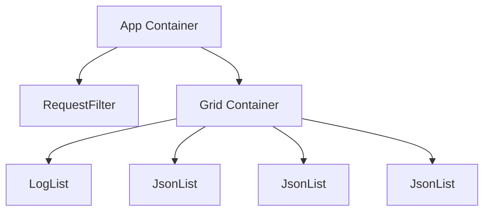

Containers are React components that manage the state and logic of the application. They are responsible for connecting the application to the Redux store and passing the necessary data and actions to the presentational components.

The <SwmToken path="src/containers/Grid.js" pos="8:2:2" line-data="class Grid extends Component {">`Grid`</SwmToken> container is a key component that organizes and displays various types of data such as active expectations, proxied requests, recorded requests, and log messages. It connects to the Redux store to retrieve this data and passes it to child components for rendering.

The <SwmToken path="src/containers/App.js" pos="6:6:6" line-data="export default class App extends Component {">`App`</SwmToken> container serves as the main entry point of the application. It sets up the initial layout by including components like <SwmToken path="src/containers/Grid.js" pos="16:1:1" line-data="        requestFilter: PropTypes.object.isRequired,">`requestFilter`</SwmToken> and <SwmToken path="src/containers/Grid.js" pos="8:2:2" line-data="class Grid extends Component {">`Grid`</SwmToken>, and it also determines the host, port, and security settings based on the current window location.

The <SwmToken path="src/containers/Grid.js" pos="5:2:2" line-data="import JsonList from &quot;../containers/JsonList&quot;;">`JsonList`</SwmToken> container is used to render lists of JSON items. It takes a header and an array of items as props and maps each item to a `JsonItem` component for display.

The <SwmPath>[src/containers/grid.css](src/containers/grid.css)</SwmPath> file contains the styling rules for the <SwmToken path="src/containers/Grid.js" pos="8:2:2" line-data="class Grid extends Component {">`Grid`</SwmToken> container, ensuring that the layout and appearance of the grid and its rows are consistent and visually appealing.

<SwmSnippet path="/src/containers/Grid.js" line="8">

---

# Grid Container

The <SwmToken path="src/containers/Grid.js" pos="8:2:2" line-data="class Grid extends Component {">`Grid`</SwmToken> container is responsible for organizing and displaying various types of data such as active expectations, proxied requests, recorded requests, and log messages. It connects to the Redux store to retrieve this data and passes it to child components for rendering.

```javascript
class Grid extends Component {
    static propTypes = {
        entities: PropTypes.shape({
            activeExpectations: PropTypes.array.isRequired,
            proxiedRequests: PropTypes.array.isRequired,
            recordedRequests: PropTypes.array.isRequired,
            logMessages: PropTypes.array.isRequired,
        }).isRequired,
        requestFilter: PropTypes.object.isRequired,
    };
```

---

</SwmSnippet>

<SwmSnippet path="/src/containers/Grid.js" line="87">

---

The <SwmToken path="src/containers/Grid.js" pos="87:2:2" line-data="const mapStateToProps = (state) =&gt; {">`mapStateToProps`</SwmToken> function maps the state from the Redux store to the props of the <SwmToken path="src/containers/Grid.js" pos="8:2:2" line-data="class Grid extends Component {">`Grid`</SwmToken> component. The <SwmToken path="src/containers/Grid.js" pos="3:3:3" line-data="import {connect} from &#39;react-redux&#39;;">`connect`</SwmToken> function from <SwmToken path="src/containers/Grid.js" pos="3:9:11" line-data="import {connect} from &#39;react-redux&#39;;">`react-redux`</SwmToken> is used to connect the <SwmToken path="src/containers/Grid.js" pos="8:2:2" line-data="class Grid extends Component {">`Grid`</SwmToken> component to the Redux store.

```javascript
const mapStateToProps = (state) => {
    const {
        activeExpectations = [],
        proxiedRequests = [],
        recordedRequests = [],
        logMessages = [],
    } = state.entities;

    const {
        requestFilter = {}
    } = state;

    return {
        entities: {
            activeExpectations,
            proxiedRequests,
            recordedRequests,
            logMessages,
        },
        requestFilter
    }
```

---

</SwmSnippet>

<SwmSnippet path="/src/containers/App.js" line="1">

---

# App Container

The <SwmToken path="src/containers/App.js" pos="6:6:6" line-data="export default class App extends Component {">`App`</SwmToken> container serves as the main entry point of the application. It sets up the initial layout by including components like <SwmToken path="src/containers/App.js" pos="2:2:2" line-data="import RequestFilter from &quot;../components/RequestFilter&quot;;">`RequestFilter`</SwmToken> and <SwmToken path="src/containers/App.js" pos="3:2:2" line-data="import Grid from &#39;./Grid&#39;;">`Grid`</SwmToken>, and it also determines the host, port, and security settings based on the current window location.

```javascript
import React, {Component} from 'react';
import RequestFilter from "../components/RequestFilter";
import Grid from './Grid';
import {parse} from 'query-string';

export default class App extends Component {
    static host() {
        if (window.location.search && parse(window.location.search).host) {
            return parse(window.location.search).host;
        } else if (window.location.hostname) {
            return window.location.hostname;
        }
        return window.location.hostname;
    }

    static port() {
        if (window.location.search && parse(window.location.search).port) {
            return parse(window.location.search).port;
        } else if (window.location.port) {
            return window.location.port;
        } else if (window.location.protocol === "https:") {
```

---

</SwmSnippet>



&nbsp;

*This is an auto-generated document by Swimm AI 🌊 and has not yet been verified by a human*

<SwmMeta version="3.0.0" repo-id="Z2l0aHViJTNBJTNBbW9ja3NlcnZlci11aSUzQSUzQVN3aW1tLURlbW8=" repo-name="mockserver-ui"><sup>Powered by [Swimm](/)</sup></SwmMeta>
