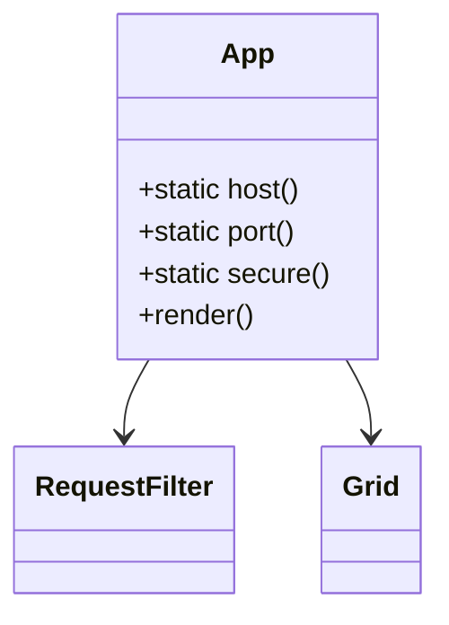

The <SwmToken path="src/index.js" pos="4:2:2" line-data="import App from &#39;./containers/App&#39;">`App`</SwmToken> class is a React component that serves as the main container for the application.

It includes static methods to determine the host, port, and security protocol based on the current window location.

The <SwmToken path="src/containers/App.js" pos="7:3:3" line-data="    static host() {">`host`</SwmToken> method checks the URL query parameters and the window location to return the appropriate hostname.

The <SwmToken path="src/containers/App.js" pos="16:3:3" line-data="    static port() {">`port`</SwmToken> method similarly checks the URL query parameters and the window location to return the appropriate port number, defaulting to 443 for HTTPS and 80 for HTTP.

The <SwmToken path="src/containers/App.js" pos="28:3:3" line-data="    static secure() {">`secure`</SwmToken> method determines if the current protocol is HTTPS.

In the <SwmToken path="src/index.js" pos="10:0:0" line-data="render(">`render`</SwmToken> method, the <SwmToken path="src/index.js" pos="4:2:2" line-data="import App from &#39;./containers/App&#39;">`App`</SwmToken> component renders the <SwmToken path="src/containers/App.js" pos="38:2:2" line-data="            &lt;RequestFilter host={App.host()} port={App.port()} secure={App.secure()}/&gt;">`RequestFilter`</SwmToken> and <SwmToken path="src/containers/App.js" pos="39:2:2" line-data="            &lt;Grid/&gt;">`Grid`</SwmToken> components, passing the host, port, and secure values as props to <SwmToken path="src/containers/App.js" pos="38:2:2" line-data="            &lt;RequestFilter host={App.host()} port={App.port()} secure={App.secure()}/&gt;">`RequestFilter`</SwmToken>.



<SwmSnippet path="/src/index.js" line="3">

---

# How to Use App

The <SwmToken path="src/index.js" pos="4:2:2" line-data="import App from &#39;./containers/App&#39;">`App`</SwmToken> class is imported and rendered within the main entry point of the application, wrapped in a <SwmToken path="src/index.js" pos="6:3:3" line-data="import {MuiThemeProvider} from &quot;material-ui&quot;;">`MuiThemeProvider`</SwmToken> and <SwmToken path="src/index.js" pos="3:3:3" line-data="import {Provider} from &#39;react-redux&#39;">`Provider`</SwmToken> for state management.

```javascript
import {Provider} from 'react-redux'
import App from './containers/App'
import configureStore from './store/configureStore'
import {MuiThemeProvider} from "material-ui";

const store = configureStore();

render(
    <Provider store={store}>
        <MuiThemeProvider>
            <App/>
        </MuiThemeProvider>
```

---

</SwmSnippet>

<SwmSnippet path="/src/containers/App.js" line="7">

---

# Static Methods in App

The <SwmToken path="src/index.js" pos="4:2:2" line-data="import App from &#39;./containers/App&#39;">`App`</SwmToken> class includes static methods <SwmToken path="src/containers/App.js" pos="7:3:3" line-data="    static host() {">`host`</SwmToken>, <SwmToken path="src/containers/App.js" pos="16:3:3" line-data="    static port() {">`port`</SwmToken>, and <SwmToken path="src/containers/App.js" pos="28:3:3" line-data="    static secure() {">`secure`</SwmToken> to determine the host, port, and security protocol based on the current window location.

```javascript
    static host() {
        if (window.location.search && parse(window.location.search).host) {
            return parse(window.location.search).host;
        } else if (window.location.hostname) {
            return window.location.hostname;
        }
        return window.location.hostname;
    }

    static port() {
        if (window.location.search && parse(window.location.search).port) {
            return parse(window.location.search).port;
        } else if (window.location.port) {
            return window.location.port;
        } else if (window.location.protocol === "https:") {
            return 443;
        } else {
            return 80;
        }
    }

```

---

</SwmSnippet>

<SwmSnippet path="/src/containers/App.js" line="36">

---

# Rendering App

In the <SwmToken path="src/containers/App.js" pos="36:1:1" line-data="    render() {">`render`</SwmToken> method, the <SwmToken path="src/containers/App.js" pos="38:7:7" line-data="            &lt;RequestFilter host={App.host()} port={App.port()} secure={App.secure()}/&gt;">`App`</SwmToken> component renders the <SwmToken path="src/containers/App.js" pos="38:2:2" line-data="            &lt;RequestFilter host={App.host()} port={App.port()} secure={App.secure()}/&gt;">`RequestFilter`</SwmToken> and <SwmToken path="src/containers/App.js" pos="39:2:2" line-data="            &lt;Grid/&gt;">`Grid`</SwmToken> components, passing the host, port, and secure values as props to <SwmToken path="src/containers/App.js" pos="38:2:2" line-data="            &lt;RequestFilter host={App.host()} port={App.port()} secure={App.secure()}/&gt;">`RequestFilter`</SwmToken>.

```javascript
    render() {
        return (<div>
            <RequestFilter host={App.host()} port={App.port()} secure={App.secure()}/>
            <Grid/>
        </div>)
    }
```

---

</SwmSnippet>

# Main functions

Main functions

<SwmSnippet path="/src/containers/App.js" line="7">

---

## host

The <SwmToken path="src/containers/App.js" pos="7:3:3" line-data="    static host() {">`host`</SwmToken> function checks the URL query parameters and the window location to return the appropriate hostname.

```javascript
    static host() {
        if (window.location.search && parse(window.location.search).host) {
            return parse(window.location.search).host;
        } else if (window.location.hostname) {
            return window.location.hostname;
        }
        return window.location.hostname;
    }
```

---

</SwmSnippet>

<SwmSnippet path="/src/containers/App.js" line="16">

---

## port

The <SwmToken path="src/containers/App.js" pos="16:3:3" line-data="    static port() {">`port`</SwmToken> function checks the URL query parameters and the window location to return the appropriate port number, defaulting to 443 for HTTPS and 80 for HTTP.

```javascript
    static port() {
        if (window.location.search && parse(window.location.search).port) {
            return parse(window.location.search).port;
        } else if (window.location.port) {
            return window.location.port;
        } else if (window.location.protocol === "https:") {
            return 443;
        } else {
            return 80;
        }
    }
```

---

</SwmSnippet>

<SwmSnippet path="/src/containers/App.js" line="28">

---

## secure

The <SwmToken path="src/containers/App.js" pos="28:3:3" line-data="    static secure() {">`secure`</SwmToken> function determines if the current protocol is HTTPS.

```javascript
    static secure() {
        if (window.location.protocol) {
            return window.location.protocol === "https:";
        } else {
            return false;
        }
    }
```

---

</SwmSnippet>

<SwmSnippet path="/src/containers/App.js" line="36">

---

## render

The <SwmToken path="src/containers/App.js" pos="36:1:1" line-data="    render() {">`render`</SwmToken> function renders the <SwmToken path="src/containers/App.js" pos="38:2:2" line-data="            &lt;RequestFilter host={App.host()} port={App.port()} secure={App.secure()}/&gt;">`RequestFilter`</SwmToken> and <SwmToken path="src/containers/App.js" pos="39:2:2" line-data="            &lt;Grid/&gt;">`Grid`</SwmToken> components, passing the host, port, and secure values as props to <SwmToken path="src/containers/App.js" pos="38:2:2" line-data="            &lt;RequestFilter host={App.host()} port={App.port()} secure={App.secure()}/&gt;">`RequestFilter`</SwmToken>.

```javascript
    render() {
        return (<div>
            <RequestFilter host={App.host()} port={App.port()} secure={App.secure()}/>
            <Grid/>
        </div>)
    }
```

---

</SwmSnippet>

&nbsp;

*This is an auto-generated document by Swimm AI 🌊 and has not yet been verified by a human*

<SwmMeta version="3.0.0" repo-id="Z2l0aHViJTNBJTNBbW9ja3NlcnZlci11aSUzQSUzQVN3aW1tLURlbW8=" repo-name="mockserver-ui"><sup>Powered by [Swimm](/)</sup></SwmMeta>
