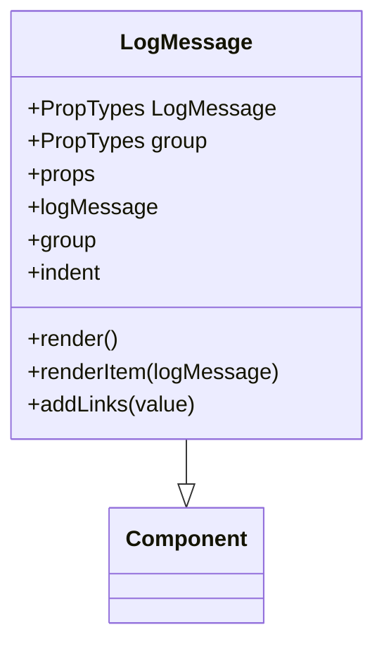

Log messages are used to display detailed information about various events and actions within the application.

The <SwmToken path="src/components/LogMessage.js" pos="6:6:6" line-data="export default class LogMessage extends Component {">`LogMessage`</SwmToken> component is responsible for rendering these log messages, which can include descriptions, message parts, and even nested log messages.

The <SwmToken path="src/components/LogMessage.js" pos="6:6:6" line-data="export default class LogMessage extends Component {">`LogMessage`</SwmToken> property is a required prop for the <SwmToken path="src/components/LogMessage.js" pos="6:6:6" line-data="export default class LogMessage extends Component {">`LogMessage`</SwmToken> component and can be either an object or an array.

The <SwmToken path="src/components/LogMessage.js" pos="33:3:3" line-data="        function renderItem(logMessage) {">`renderItem`</SwmToken> function within the <SwmToken path="src/components/LogMessage.js" pos="6:6:6" line-data="export default class LogMessage extends Component {">`LogMessage`</SwmToken> component handles the rendering of individual log messages, applying styles and formatting as needed.

The <SwmToken path="src/components/LogMessage.js" pos="14:3:3" line-data="        function addLinks(value) {">`addLinks`</SwmToken> function is used to identify and convert URLs within log messages into clickable links.

Log messages can be grouped together using the <SwmToken path="src/components/LogMessage.js" pos="9:1:1" line-data="        group: PropTypes.object">`group`</SwmToken> property, allowing for a hierarchical display of related log messages.



<SwmSnippet path="/src/components/LogMessage.js" line="6">

---

# <SwmToken path="src/components/LogMessage.js" pos="6:6:6" line-data="export default class LogMessage extends Component {">`LogMessage`</SwmToken> Component

The <SwmToken path="src/components/LogMessage.js" pos="6:6:6" line-data="export default class LogMessage extends Component {">`LogMessage`</SwmToken> component is defined with <SwmToken path="src/components/LogMessage.js" pos="6:6:6" line-data="export default class LogMessage extends Component {">`LogMessage`</SwmToken> as a required prop, which can be either an object or an array.

```javascript
export default class LogMessage extends Component {
    static propTypes = {
        logMessage: PropTypes.oneOfType([PropTypes.object.isRequired, PropTypes.array.isRequired]).isRequired,
        group: PropTypes.object
    };
```

---

</SwmSnippet>

<SwmSnippet path="/src/components/LogMessage.js" line="14">

---

# <SwmToken path="src/components/LogMessage.js" pos="14:3:3" line-data="        function addLinks(value) {">`addLinks`</SwmToken> Function

The <SwmToken path="src/components/LogMessage.js" pos="14:3:3" line-data="        function addLinks(value) {">`addLinks`</SwmToken> function identifies URLs within log messages and converts them into clickable links.

```javascript
        function addLinks(value) {
            var urlMatch = value.match("(http){1}s?://[^\\s]*");
            if (urlMatch) {
                let matchedUrl = urlMatch[0];
                return (<span>{value.substr(0, value.indexOf(matchedUrl))}<a style={{
                    textDecoration: "underline",
                    color: "rgb(95, 113, 245)"
                }} href={matchedUrl} target="_blank" rel="noopener noreferrer">{matchedUrl}</a>{value.substr(value.indexOf(matchedUrl) + matchedUrl.length)}</span>);
            } else {
                return value;
            }
        }
```

---

</SwmSnippet>

<SwmSnippet path="/src/components/LogMessage.js" line="33">

---

# <SwmToken path="src/components/LogMessage.js" pos="33:3:3" line-data="        function renderItem(logMessage) {">`renderItem`</SwmToken> Function

The <SwmToken path="src/components/LogMessage.js" pos="33:3:3" line-data="        function renderItem(logMessage) {">`renderItem`</SwmToken> function handles the rendering of individual log messages, applying styles and formatting as needed.

```javascript
        function renderItem(logMessage) {
            let cellStyle = {
                display: "table-cell",
                fontFamily: "monospace, Roboto, sans-serif"
            };
            return <div style={Object.assign({
                paddingLeft: "5px",
                paddingRight: "5px",
                fontSize: indent ? "0.9em" : "1.0em"
            }, logMessage.style)}>
                <div style={Object.assign({
                    whiteSpace: "pre",
                    position: "relative",
                }, cellStyle)}>{logMessage.description}</div>
                {logMessage.messageParts ? logMessage.messageParts.map((messagePart) => {
                    if (messagePart.value) {
                        if (!messagePart.argument) {
                            return <div key={messagePart.key}
                                        style={cellStyle}>{addLinks(messagePart.value)}</div>;
                        } else {
                            if (messagePart.multiline || messagePart.because) {
```

---

</SwmSnippet>

<SwmSnippet path="/src/components/LogMessage.js" line="177">

---

# Grouping Log Messages

Log messages can be grouped together using the <SwmToken path="src/components/LogMessage.js" pos="177:4:4" line-data="        if (group) {">`group`</SwmToken> property, allowing for a hierarchical display of related log messages.

```javascript
        if (group) {
            return (<details className={"logGroup"}>
                <summary style={{
                    color: "rgb(222, 147, 95)",
                    // backgroundColor: "rgb(43, 52, 62)"
                }}><LogMessage key={group.key + "_summary"}
                               logMessage={group.value}/></summary>
                <div style={{
                    borderStyle: "dashed",
                    borderColor: "rgb(43, 52, 62)",
                    marginLeft: "35px",
                    marginTop: "10px",
                    marginRight: "5px",
                    marginBottom: "10px",
                    display: "inline-block",
                    paddingLeft: "5px",
                    paddingRight: "5px",
                    paddingBottom: "5px",
                }}>{logMessage.map((item, index) => <LogMessage index={index}
                                                                indent={true}
                                                                key={item.key}
```

---

</SwmSnippet>

# Main functions

Main functions

<SwmSnippet path="/src/components/LogMessage.js" line="14">

---

## <SwmToken path="src/components/LogMessage.js" pos="14:3:3" line-data="        function addLinks(value) {">`addLinks`</SwmToken>

The <SwmToken path="src/components/LogMessage.js" pos="14:3:3" line-data="        function addLinks(value) {">`addLinks`</SwmToken> function is used to identify and convert URLs within log messages into clickable links. It searches for URLs in the provided value and wraps them in anchor tags with specific styles.

```javascript
        function addLinks(value) {
            var urlMatch = value.match("(http){1}s?://[^\\s]*");
            if (urlMatch) {
                let matchedUrl = urlMatch[0];
                return (<span>{value.substr(0, value.indexOf(matchedUrl))}<a style={{
                    textDecoration: "underline",
                    color: "rgb(95, 113, 245)"
                }} href={matchedUrl} target="_blank" rel="noopener noreferrer">{matchedUrl}</a>{value.substr(value.indexOf(matchedUrl) + matchedUrl.length)}</span>);
            } else {
                return value;
            }
        }
```

---

</SwmSnippet>

<SwmSnippet path="/src/components/LogMessage.js" line="33">

---

## <SwmToken path="src/components/LogMessage.js" pos="33:3:3" line-data="        function renderItem(logMessage) {">`renderItem`</SwmToken>

The <SwmToken path="src/components/LogMessage.js" pos="33:3:3" line-data="        function renderItem(logMessage) {">`renderItem`</SwmToken> function handles the rendering of individual log messages. It applies styles and formatting to the log message, including handling nested message parts and converting URLs to clickable links using the <SwmToken path="src/components/LogMessage.js" pos="51:8:8" line-data="                                        style={cellStyle}&gt;{addLinks(messagePart.value)}&lt;/div&gt;;">`addLinks`</SwmToken> function.

```javascript
        function renderItem(logMessage) {
            let cellStyle = {
                display: "table-cell",
                fontFamily: "monospace, Roboto, sans-serif"
            };
            return <div style={Object.assign({
                paddingLeft: "5px",
                paddingRight: "5px",
                fontSize: indent ? "0.9em" : "1.0em"
            }, logMessage.style)}>
                <div style={Object.assign({
                    whiteSpace: "pre",
                    position: "relative",
                }, cellStyle)}>{logMessage.description}</div>
                {logMessage.messageParts ? logMessage.messageParts.map((messagePart) => {
                    if (messagePart.value) {
                        if (!messagePart.argument) {
                            return <div key={messagePart.key}
                                        style={cellStyle}>{addLinks(messagePart.value)}</div>;
                        } else {
                            if (messagePart.multiline || messagePart.because) {
```

---

</SwmSnippet>

&nbsp;

*This is an auto-generated document by Swimm AI 🌊 and has not yet been verified by a human*

<SwmMeta version="3.0.0" repo-id="Z2l0aHViJTNBJTNBbW9ja3NlcnZlci11aSUzQSUzQVN3aW1tLURlbW8=" repo-name="mockserver-ui"><sup>Powered by [Swimm](/)</sup></SwmMeta>
