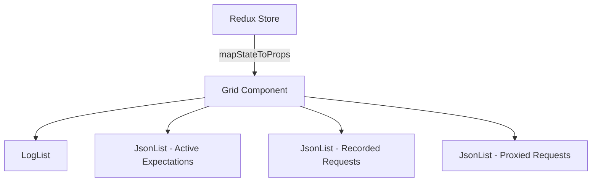
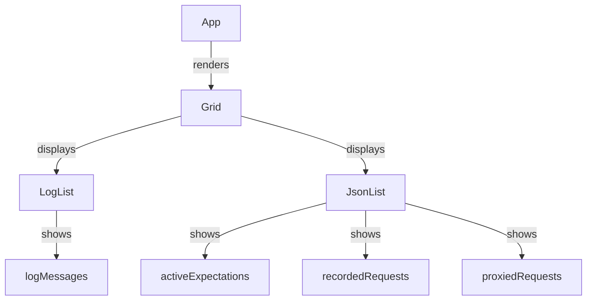

Grid is a React component that displays various types of data in a structured layout.

It uses <SwmToken path="src/containers/Grid.js" pos="4:2:2" line-data="import LogList from &quot;../containers/LogList&quot;;">`LogList`</SwmToken> and <SwmToken path="src/containers/Grid.js" pos="5:2:2" line-data="import JsonList from &quot;../containers/JsonList&quot;;">`JsonList`</SwmToken> components to render log messages, active expectations, recorded requests, and proxied requests.

The component is connected to the Redux store to access the state and map it to its props.

The <SwmToken path="src/containers/Grid.js" pos="19:1:1" line-data="    render() {">`render`</SwmToken> method organizes the data into rows and columns, applying styles for margins, padding, and borders to ensure a consistent layout.

Each section within the grid is styled with a dashed border and specific dimensions to maintain a clear separation between different types of data.

The <SwmToken path="src/containers/Grid.js" pos="8:2:2" line-data="class Grid extends Component {">`Grid`</SwmToken> component is used in the <SwmToken path="src/containers/App.js" pos="6:6:6" line-data="export default class App extends Component {">`App`</SwmToken> component to display the data fetched from the MockServer.



<SwmSnippet path="/src/containers/Grid.js" line="8">

---

# Grid Component

The <SwmToken path="src/containers/Grid.js" pos="8:2:2" line-data="class Grid extends Component {">`Grid`</SwmToken> component is defined as a class that extends <SwmToken path="src/containers/Grid.js" pos="8:6:6" line-data="class Grid extends Component {">`Component`</SwmToken>. It uses <SwmToken path="src/containers/Grid.js" pos="9:3:3" line-data="    static propTypes = {">`propTypes`</SwmToken> to define the expected structure of its props, ensuring that the required data is passed correctly.

```javascript
class Grid extends Component {
    static propTypes = {
        entities: PropTypes.shape({
            activeExpectations: PropTypes.array.isRequired,
            proxiedRequests: PropTypes.array.isRequired,
            recordedRequests: PropTypes.array.isRequired,
            logMessages: PropTypes.array.isRequired,
        }).isRequired,
        requestFilter: PropTypes.object.isRequired,
    };

    render() {
        const {
            entities: {
                activeExpectations = [],
                proxiedRequests = [],
                recordedRequests = [],
                logMessages = [],
            },
        } = this.props;
        return (
```

---

</SwmSnippet>

<SwmSnippet path="/src/containers/Grid.js" line="19">

---

# Render Method

The <SwmToken path="src/containers/Grid.js" pos="19:1:1" line-data="    render() {">`render`</SwmToken> method of the <SwmToken path="src/containers/Grid.js" pos="8:2:2" line-data="class Grid extends Component {">`Grid`</SwmToken> component organizes the data into rows and columns. It applies styles for margins, padding, and borders to ensure a consistent layout. Each section within the grid is styled with a dashed border and specific dimensions to maintain a clear separation between different types of data.

```javascript
    render() {
        const {
            entities: {
                activeExpectations = [],
                proxiedRequests = [],
                recordedRequests = [],
                logMessages = [],
            },
        } = this.props;
        return (
            <div style={{
                margin: "1%",
                width: "98%"
            }}>
                <div className="row" style={{
                    borderStyle: "dashed",
                    borderWidth: "1px",
                    margin: "15px 0",
                    padding: "17px 17px",
                    minWidth: "1100px",
                }}>
```

---

</SwmSnippet>

<SwmSnippet path="/src/containers/App.js" line="2">

---

# Usage in App Component

The <SwmToken path="src/containers/App.js" pos="3:2:2" line-data="import Grid from &#39;./Grid&#39;;">`Grid`</SwmToken> component is imported and used in the <SwmToken path="src/containers/App.js" pos="6:6:6" line-data="export default class App extends Component {">`App`</SwmToken> component. It is rendered to display the data fetched from the MockServer, providing a structured and organized view of the log messages, active expectations, recorded requests, and proxied requests.

```javascript
import RequestFilter from "../components/RequestFilter";
import Grid from './Grid';
import {parse} from 'query-string';

export default class App extends Component {
    static host() {
        if (window.location.search && parse(window.location.search).host) {
            return parse(window.location.search).host;
        } else if (window.location.hostname) {
            return window.location.hostname;
        }
        return window.location.hostname;
    }

    static port() {
        if (window.location.search && parse(window.location.search).port) {
            return parse(window.location.search).port;
        } else if (window.location.port) {
            return window.location.port;
        } else if (window.location.protocol === "https:") {
            return 443;
```

---

</SwmSnippet>



# Main functions

There are several main functions in this component. Some of them are render, <SwmToken path="src/containers/Grid.js" pos="87:2:2" line-data="const mapStateToProps = (state) =&gt; {">`mapStateToProps`</SwmToken>, and <SwmToken path="src/containers/Grid.js" pos="110:2:2" line-data="const mapDispatchToProps = {};">`mapDispatchToProps`</SwmToken>. We will dive a little into render.

<SwmSnippet path="/src/containers/Grid.js" line="19">

---

## render

The <SwmToken path="src/containers/Grid.js" pos="19:1:1" line-data="    render() {">`render`</SwmToken> function is responsible for organizing and displaying the data in a structured layout. It uses <SwmToken path="src/containers/Grid.js" pos="4:2:2" line-data="import LogList from &quot;../containers/LogList&quot;;">`LogList`</SwmToken> and <SwmToken path="src/containers/Grid.js" pos="5:2:2" line-data="import JsonList from &quot;../containers/JsonList&quot;;">`JsonList`</SwmToken> components to render log messages, active expectations, recorded requests, and proxied requests. The function applies styles for margins, padding, and borders to ensure a consistent layout and clear separation between different types of data.

```javascript
    render() {
        const {
            entities: {
                activeExpectations = [],
                proxiedRequests = [],
                recordedRequests = [],
                logMessages = [],
            },
        } = this.props;
        return (
            <div style={{
                margin: "1%",
                width: "98%"
            }}>
                <div className="row" style={{
                    borderStyle: "dashed",
                    borderWidth: "1px",
                    margin: "15px 0",
                    padding: "17px 17px",
                    minWidth: "1100px",
                }}>
```

---

</SwmSnippet>

&nbsp;

*This is an auto-generated document by Swimm AI 🌊 and has not yet been verified by a human*

<SwmMeta version="3.0.0" repo-id="Z2l0aHViJTNBJTNBbW9ja3NlcnZlci11aSUzQSUzQVN3aW1tLURlbW8=" repo-name="mockserver-ui"><sup>Powered by [Swimm](/)</sup></SwmMeta>
