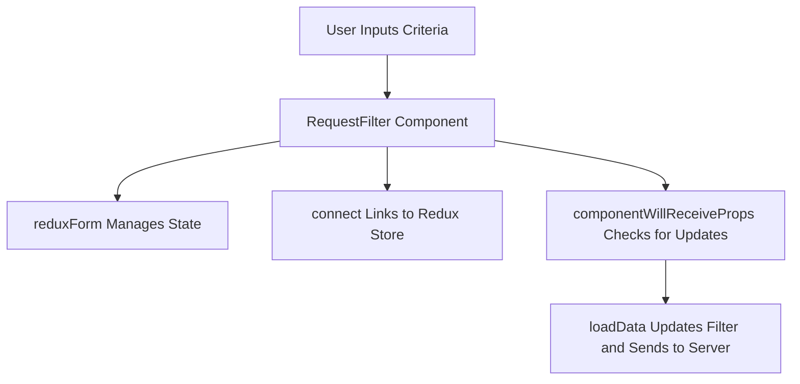

Request filter is a component that allows users to specify criteria for filtering HTTP requests.

It includes fields for method, path, headers, query string parameters, and cookies.

The component uses <SwmToken path="src/components/RequestFilter.js" pos="435:4:4" line-data="RequestFilter = reduxForm({">`reduxForm`</SwmToken> to manage form state and <SwmToken path="src/components/RequestFilter.js" pos="461:4:4" line-data="RequestFilter = connect(">`connect`</SwmToken> to link it with the Redux store.

When the component receives new props, it calls the <SwmToken path="src/components/RequestFilter.js" pos="49:2:2" line-data="const loadData = ({host = &quot;127.0.0.1&quot;, port = &quot;1080&quot;, secure = true, requestMatcher = {}, sendMessage}) =&gt; {">`loadData`</SwmToken> function to update the request filter based on the new criteria.

The <SwmToken path="src/components/RequestFilter.js" pos="49:2:2" line-data="const loadData = ({host = &quot;127.0.0.1&quot;, port = &quot;1080&quot;, secure = true, requestMatcher = {}, sendMessage}) =&gt; {">`loadData`</SwmToken> function constructs a request filter object and sends it to the server using the <SwmToken path="src/components/RequestFilter.js" pos="49:47:47" line-data="const loadData = ({host = &quot;127.0.0.1&quot;, port = &quot;1080&quot;, secure = true, requestMatcher = {}, sendMessage}) =&gt; {">`sendMessage`</SwmToken> function.

The component also includes methods for rendering form fields and handling user interactions, such as adding or removing fields.

<SwmSnippet path="/src/components/RequestFilter.js" line="76">

---

# Request Filter Component

The <SwmToken path="src/components/RequestFilter.js" pos="76:2:2" line-data="class RequestFilter extends Component {">`RequestFilter`</SwmToken> class component defines the structure and behavior of the request filter. It includes prop types for host, port, and secure.

```javascript
class RequestFilter extends Component {
    static propTypes = {
        host: PropTypes.string.isRequired,
        port: PropTypes.string.isRequired,
        secure: PropTypes.bool.isRequired
    };
```

---

</SwmSnippet>

<SwmSnippet path="/src/components/RequestFilter.js" line="87">

---

# Handling New Props

The <SwmToken path="src/components/RequestFilter.js" pos="87:1:1" line-data="    componentWillReceiveProps(nextProps) {">`componentWillReceiveProps`</SwmToken> method checks if the request matcher or expanded state has changed. If so, it calls the <SwmToken path="src/components/RequestFilter.js" pos="89:1:1" line-data="            loadData(nextProps)">`loadData`</SwmToken> function to update the request filter.

```javascript
    componentWillReceiveProps(nextProps) {
        if (nextProps.requestMatcher !== this.props.requestMatcher || nextProps.expanded !== this.props.expanded) {
            loadData(nextProps)
        }
    }
```

---

</SwmSnippet>

<SwmSnippet path="/src/components/RequestFilter.js" line="49">

---

# Loading Data

The <SwmToken path="src/components/RequestFilter.js" pos="49:2:2" line-data="const loadData = ({host = &quot;127.0.0.1&quot;, port = &quot;1080&quot;, secure = true, requestMatcher = {}, sendMessage}) =&gt; {">`loadData`</SwmToken> function constructs a request filter object based on the provided criteria and sends it to the server using the <SwmToken path="src/components/RequestFilter.js" pos="49:47:47" line-data="const loadData = ({host = &quot;127.0.0.1&quot;, port = &quot;1080&quot;, secure = true, requestMatcher = {}, sendMessage}) =&gt; {">`sendMessage`</SwmToken> function.

```javascript
const loadData = ({host = "127.0.0.1", port = "1080", secure = true, requestMatcher = {}, sendMessage}) => {
    let requestFilter = {
        method: undefined,
        path: undefined,
        keepAlive: undefined,
        secure: undefined,
        headers: undefined,
        queryStringParameters: undefined,
        cookies: undefined,
    };
    if (requestMatcher.enabled) {
        requestFilter = {
            method: requestMatcher.method,
            path: requestMatcher.path,
            keepAlive: requestMatcher.keepAlive ? true : undefined,
            secure: requestMatcher.secure ? true : undefined,
            headers: undefined,
            queryStringParameters: undefined,
            cookies: undefined,
        };
        requestFilter.cookies = filterNullsSingleValue(requestMatcher.cookies);
```

---

</SwmSnippet>

<SwmSnippet path="/src/components/RequestFilter.js" line="435">

---

# Form State Management

The <SwmToken path="src/components/RequestFilter.js" pos="435:4:4" line-data="RequestFilter = reduxForm({">`reduxForm`</SwmToken> function is used to manage the form state. It initializes the form with default values and ensures the form state is preserved even when the component is unmounted.

```javascript
RequestFilter = reduxForm({
    form: formName,
    initialValues: {
        headers: [{
            values: [""]
        }],
        queryStringParameters: [{
            values: [""]
        }],
        cookies: [{}],
    },
    destroyOnUnmount: false
})(RequestFilter);
```

---

</SwmSnippet>

<SwmSnippet path="/src/components/RequestFilter.js" line="461">

---

# Connecting to Redux Store

The <SwmToken path="src/components/RequestFilter.js" pos="461:4:4" line-data="RequestFilter = connect(">`connect`</SwmToken> function links the <SwmToken path="src/components/RequestFilter.js" pos="461:0:0" line-data="RequestFilter = connect(">`RequestFilter`</SwmToken> component to the Redux store, allowing it to access the state and dispatch actions.

```javascript
RequestFilter = connect(
    mapStateToProps,
    mapDispatchToProps,
    undefined,
    {pure: true}
)(RequestFilter);
```

---

</SwmSnippet>



# Main functions

There are several main functions in this folder. Some of them are <SwmToken path="src/components/RequestFilter.js" pos="19:2:2" line-data="let filterNullsMultiValue = function (rawItems) {">`filterNullsMultiValue`</SwmToken>, <SwmToken path="src/components/RequestFilter.js" pos="37:2:2" line-data="let filterNullsSingleValue = function (rawItems) {">`filterNullsSingleValue`</SwmToken>, <SwmToken path="src/components/RequestFilter.js" pos="49:2:2" line-data="const loadData = ({host = &quot;127.0.0.1&quot;, port = &quot;1080&quot;, secure = true, requestMatcher = {}, sendMessage}) =&gt; {">`loadData`</SwmToken>, <SwmToken path="src/components/RequestFilter.js" pos="93:1:1" line-data="    renderValues = ({fields, disabled}) =&gt; {">`renderValues`</SwmToken>, <SwmToken path="src/components/RequestFilter.js" pos="143:1:1" line-data="    renderKeysToMultiValues = ({fields, disabled, title}) =&gt; {">`renderKeysToMultiValues`</SwmToken>, and <SwmToken path="src/components/RequestFilter.js" pos="205:1:1" line-data="    renderKeysToValues = ({fields, disabled, title}) =&gt; {">`renderKeysToValues`</SwmToken>. We will dive a little into <SwmToken path="src/components/RequestFilter.js" pos="19:2:2" line-data="let filterNullsMultiValue = function (rawItems) {">`filterNullsMultiValue`</SwmToken>, <SwmToken path="src/components/RequestFilter.js" pos="37:2:2" line-data="let filterNullsSingleValue = function (rawItems) {">`filterNullsSingleValue`</SwmToken>, <SwmToken path="src/components/RequestFilter.js" pos="49:2:2" line-data="const loadData = ({host = &quot;127.0.0.1&quot;, port = &quot;1080&quot;, secure = true, requestMatcher = {}, sendMessage}) =&gt; {">`loadData`</SwmToken>, <SwmToken path="src/components/RequestFilter.js" pos="93:1:1" line-data="    renderValues = ({fields, disabled}) =&gt; {">`renderValues`</SwmToken>, <SwmToken path="src/components/RequestFilter.js" pos="143:1:1" line-data="    renderKeysToMultiValues = ({fields, disabled, title}) =&gt; {">`renderKeysToMultiValues`</SwmToken>, and <SwmToken path="src/components/RequestFilter.js" pos="205:1:1" line-data="    renderKeysToValues = ({fields, disabled, title}) =&gt; {">`renderKeysToValues`</SwmToken>.

<SwmSnippet path="/src/components/RequestFilter.js" line="19">

---

## <SwmToken path="src/components/RequestFilter.js" pos="19:2:2" line-data="let filterNullsMultiValue = function (rawItems) {">`filterNullsMultiValue`</SwmToken>

The <SwmToken path="src/components/RequestFilter.js" pos="19:2:2" line-data="let filterNullsMultiValue = function (rawItems) {">`filterNullsMultiValue`</SwmToken> function processes an array of items, filtering out those that have null or undefined values in their <SwmToken path="src/components/RequestFilter.js" pos="23:12:12" line-data="        for (let value of rawItem.values) {">`values`</SwmToken> property. It returns a new array with only the valid items.

```javascript
let filterNullsMultiValue = function (rawItems) {
    let items = undefined;
    for (let rawItem of rawItems) {
        let valueSet = false;
        for (let value of rawItem.values) {
            if (value) {
                valueSet = true;
            }
        }
        if (rawItem.name && valueSet) {
            if (!items) {
                items = [];
            }
            items.push(rawItem);
        }
    }
    return items;
```

---

</SwmSnippet>

<SwmSnippet path="/src/components/RequestFilter.js" line="37">

---

## <SwmToken path="src/components/RequestFilter.js" pos="37:2:2" line-data="let filterNullsSingleValue = function (rawItems) {">`filterNullsSingleValue`</SwmToken>

The <SwmToken path="src/components/RequestFilter.js" pos="37:2:2" line-data="let filterNullsSingleValue = function (rawItems) {">`filterNullsSingleValue`</SwmToken> function processes an array of items, filtering out those that have null or undefined values in their <SwmToken path="src/components/RequestFilter.js" pos="40:12:12" line-data="        if (rawItem.name &amp;&amp; rawItem.value) {">`value`</SwmToken> property. It returns a new array with only the valid items.

```javascript
let filterNullsSingleValue = function (rawItems) {
    let items = undefined;
    for (let rawItem of rawItems) {
        if (rawItem.name && rawItem.value) {
            if (!items) {
                items = [];
            }
            items.push(rawItem);
        }
    }
    return items;
```

---

</SwmSnippet>

<SwmSnippet path="/src/components/RequestFilter.js" line="49">

---

## <SwmToken path="src/components/RequestFilter.js" pos="49:2:2" line-data="const loadData = ({host = &quot;127.0.0.1&quot;, port = &quot;1080&quot;, secure = true, requestMatcher = {}, sendMessage}) =&gt; {">`loadData`</SwmToken>

The <SwmToken path="src/components/RequestFilter.js" pos="49:2:2" line-data="const loadData = ({host = &quot;127.0.0.1&quot;, port = &quot;1080&quot;, secure = true, requestMatcher = {}, sendMessage}) =&gt; {">`loadData`</SwmToken> function constructs a request filter object based on the provided parameters and sends it to the server using the <SwmToken path="src/components/RequestFilter.js" pos="49:47:47" line-data="const loadData = ({host = &quot;127.0.0.1&quot;, port = &quot;1080&quot;, secure = true, requestMatcher = {}, sendMessage}) =&gt; {">`sendMessage`</SwmToken> function. It uses <SwmToken path="src/components/RequestFilter.js" pos="19:2:2" line-data="let filterNullsMultiValue = function (rawItems) {">`filterNullsMultiValue`</SwmToken> and <SwmToken path="src/components/RequestFilter.js" pos="69:7:7" line-data="        requestFilter.cookies = filterNullsSingleValue(requestMatcher.cookies);">`filterNullsSingleValue`</SwmToken> to process headers, query string parameters, and cookies.

```javascript
const loadData = ({host = "127.0.0.1", port = "1080", secure = true, requestMatcher = {}, sendMessage}) => {
    let requestFilter = {
        method: undefined,
        path: undefined,
        keepAlive: undefined,
        secure: undefined,
        headers: undefined,
        queryStringParameters: undefined,
        cookies: undefined,
    };
    if (requestMatcher.enabled) {
        requestFilter = {
            method: requestMatcher.method,
            path: requestMatcher.path,
            keepAlive: requestMatcher.keepAlive ? true : undefined,
            secure: requestMatcher.secure ? true : undefined,
            headers: undefined,
            queryStringParameters: undefined,
            cookies: undefined,
        };
        requestFilter.cookies = filterNullsSingleValue(requestMatcher.cookies);
```

---

</SwmSnippet>

<SwmSnippet path="/src/components/RequestFilter.js" line="93">

---

## <SwmToken path="src/components/RequestFilter.js" pos="93:1:1" line-data="    renderValues = ({fields, disabled}) =&gt; {">`renderValues`</SwmToken>

The <SwmToken path="src/components/RequestFilter.js" pos="93:1:1" line-data="    renderValues = ({fields, disabled}) =&gt; {">`renderValues`</SwmToken> function renders a set of input fields for values. It allows users to add or remove fields dynamically. This function is used to handle multi-value fields like headers and query string parameters.

```javascript
    renderValues = ({fields, disabled}) => {
        return (
            <div style={{
                width: "50%",
                padding: "5px",
                paddingRight: "10px",
                display: "inline-block",
                verticalAlign: "bottom",
            }}>
                {fields.map((field, index) => <div key={index} style={{
                    display: "inline-block",
                    width: "70%",
                }}>

                    <Field
                        disabled={disabled}
                        fullWidth={true}
                        style={{
                            width: "75%",
                        }}
                        name={field}
```

---

</SwmSnippet>

<SwmSnippet path="/src/components/RequestFilter.js" line="143">

---

## <SwmToken path="src/components/RequestFilter.js" pos="143:1:1" line-data="    renderKeysToMultiValues = ({fields, disabled, title}) =&gt; {">`renderKeysToMultiValues`</SwmToken>

The <SwmToken path="src/components/RequestFilter.js" pos="143:1:1" line-data="    renderKeysToMultiValues = ({fields, disabled, title}) =&gt; {">`renderKeysToMultiValues`</SwmToken> function renders a set of input fields for keys and their corresponding multi-values. It allows users to add or remove key-value pairs dynamically.

```javascript
    renderKeysToMultiValues = ({fields, disabled, title}) => {
        return (<div style={{
            width: "100%",
            display: "inline-block",
            paddingRight: "10px",
        }}>
            <div style={{
                color: disabled ? "#9c9c9c" : "rgb(0, 188, 212)",
                width: "20%",
                paddingTop: "45px",
                paddingRight: "15px",
                display: "inline-block",
                verticalAlign: "top",
                textAlign: "right",
                fontFamily: "Roboto, sans-serif",
            }}>{title}
            </div>
            <div style={{
                display: "inline-block",
                width: "75%",
            }}>
```

---

</SwmSnippet>

<SwmSnippet path="/src/components/RequestFilter.js" line="205">

---

## <SwmToken path="src/components/RequestFilter.js" pos="205:1:1" line-data="    renderKeysToValues = ({fields, disabled, title}) =&gt; {">`renderKeysToValues`</SwmToken>

The <SwmToken path="src/components/RequestFilter.js" pos="205:1:1" line-data="    renderKeysToValues = ({fields, disabled, title}) =&gt; {">`renderKeysToValues`</SwmToken> function renders a set of input fields for keys and their corresponding single values. It allows users to add or remove key-value pairs dynamically.

```javascript
    renderKeysToValues = ({fields, disabled, title}) => {
        return (<div style={{
            width: "100%",
            display: "inline-block",
            paddingRight: "10px",
        }}>
            <div style={{
                color: disabled ? "#9c9c9c" : "rgb(0, 188, 212)",
                width: "20%",
                paddingTop: "45px",
                paddingRight: "15px",
                display: "inline-block",
                verticalAlign: "top",
                textAlign: "right",
                fontFamily: "Roboto, sans-serif",
            }}>{title}
            </div>
            <div style={{
                display: "inline-block",
                width: "75%",
            }}>
```

---

</SwmSnippet>

&nbsp;

*This is an auto-generated document by Swimm AI 🌊 and has not yet been verified by a human*

<SwmMeta version="3.0.0" repo-id="Z2l0aHViJTNBJTNBbW9ja3NlcnZlci11aSUzQSUzQVN3aW1tLURlbW8=" repo-name="mockserver-ui"><sup>Powered by [Swimm](/)</sup></SwmMeta>
